# 电气学院成绩管理系统
此系统是由C#语言编写的Visual Studio解决方案，在使用该系统时，需在电脑上已安装SQL Server并建立成绩数据库。
该系统可实现学生成绩查询、成绩录入、成绩修改以及成绩删除的功能。  

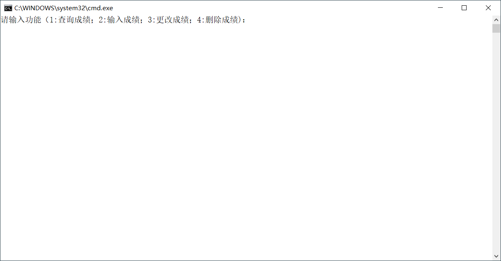  

## 功能
- 学生通过学号查询自己的各科成绩以及加权成绩；  
- 教师通过课程名称录入部分或全部学生成绩；  
- 教师通过课程名称以及学生学号修改、删除该生成绩。

## 使用前提  
- 计算机需已安装[Visual Studio](https://visualstudio.microsoft.com/zh-hans/vs/);
- 计算机需已安装[SQL Server](https://www.microsoft.com/zh-cn/sql-server/sql-server-downloads)并已在该数据库中建立电气学院成绩数据库以连接。

## 反馈
若在使用该系统中遇到问题或者对该系统有意见或者建议，请发送邮件至Email:<gaifa1514@iCloud.com>。

## 使用指南
### 进入界面时，通过键入数字并按下Enter键选择相应的功能：  
#### 1：查询成绩
- 通过键入学号并按下Enter键查询成绩。  
 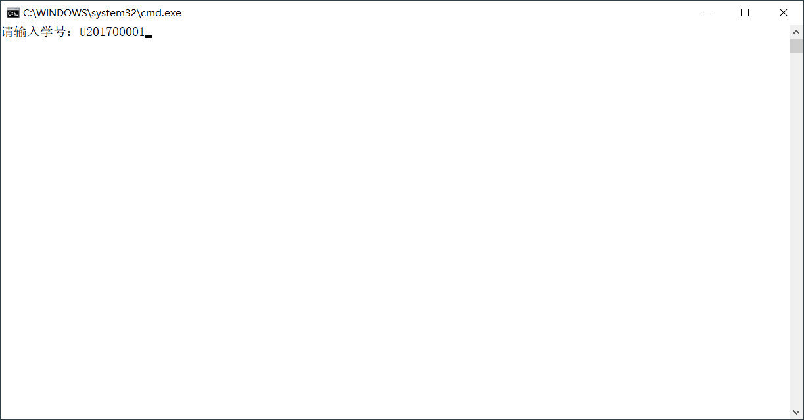  
- 显示成绩界面。  
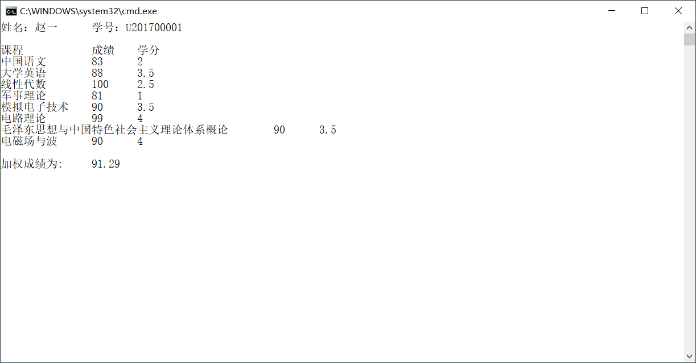  

#### 2：录入成绩
##### 1. 输入所要录入成绩的课程并按下Enter；
##### 2. 键入数字并按下Enter键：  
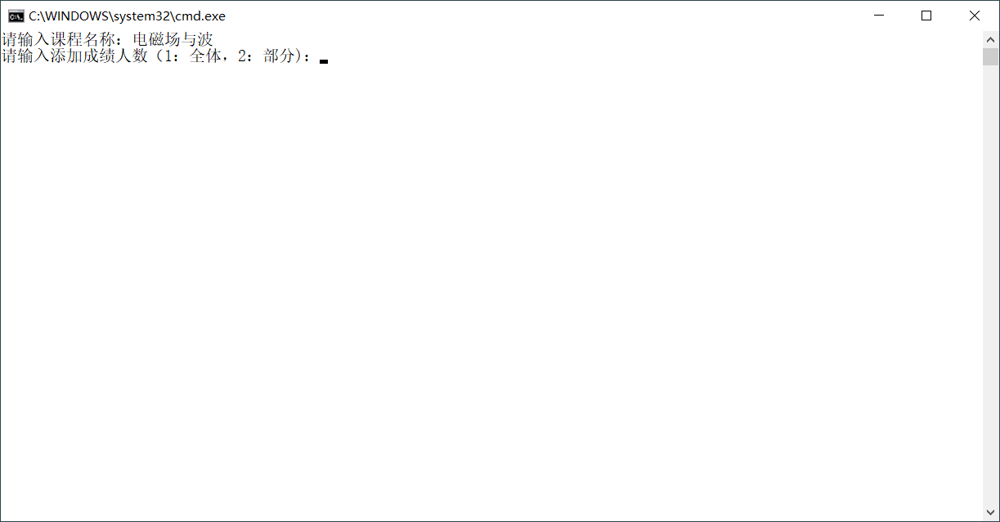  
###### 1：录入全体学生成绩
- 按照学号次序依次录入学生成绩并按下Enter键：
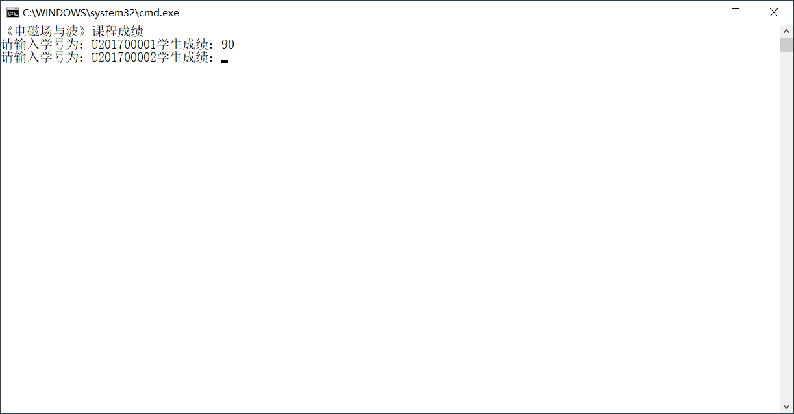 
- 若该课程成绩均未录入，显示成绩录入成功。
 
###### 2：录入部分学生成绩
- 键入学生学号并按下Enter键后键入该生成绩并按下Enter键；  
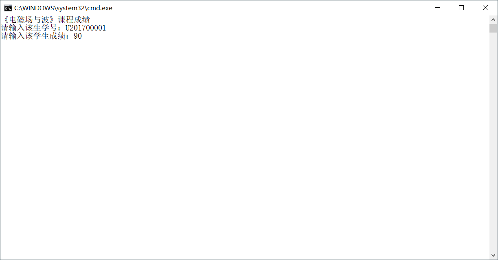   
- 若该生该科目成绩未录入，则录入成功；
- 进入选择：键入1并按下Enter键则可以继续录入；键入2并按下Enter键则停止录入。  
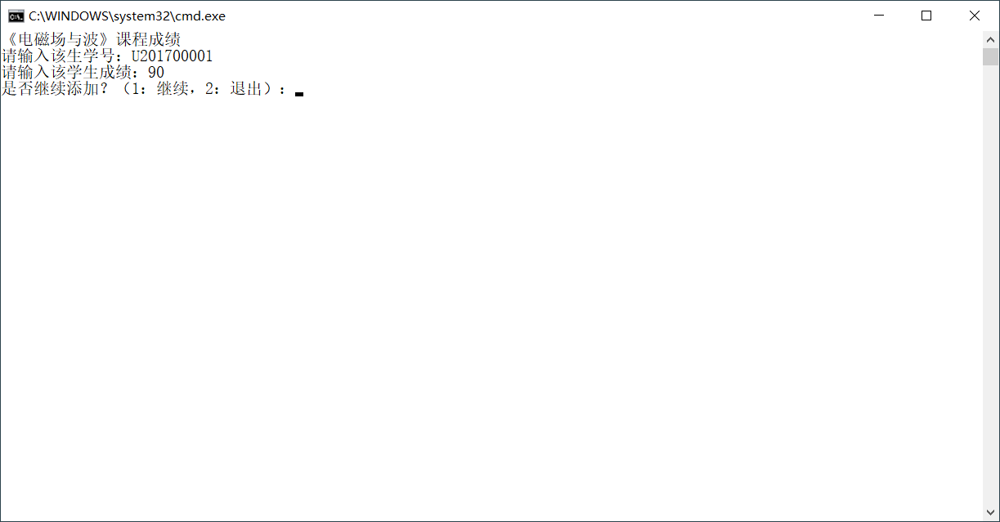

#### 3：修改成绩
- ##### 按照提示依次键入所要修改成绩的课程、学生的学号以及修改后的成绩；
  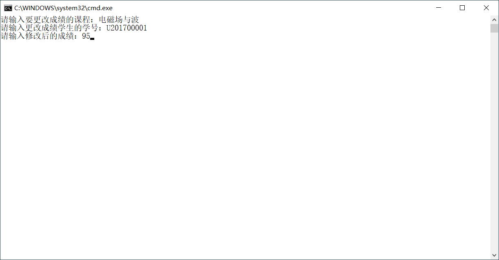
- ##### 修改成功提示界面。
  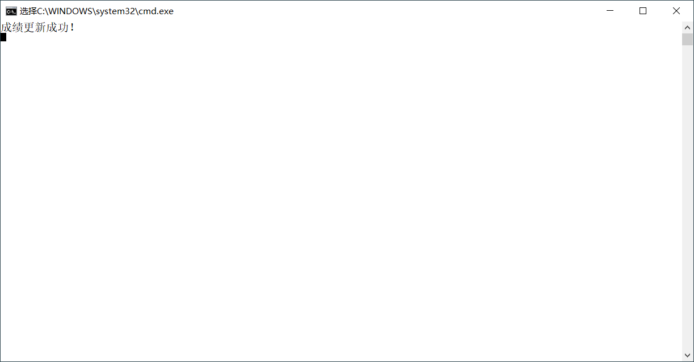

#### 4：删除成绩
- ##### 按照提示依次键入所要删除的成绩的课程以及学生的学号。
  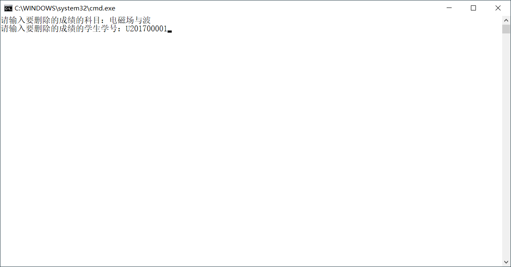
- ##### 提示删除成功。
  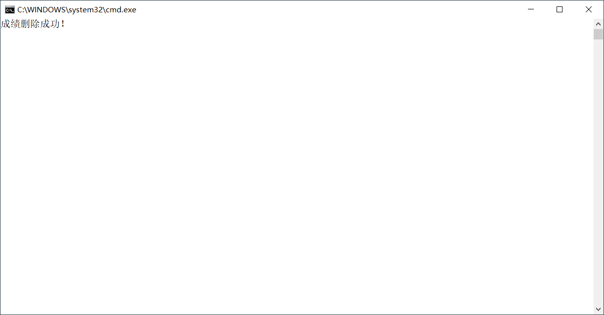